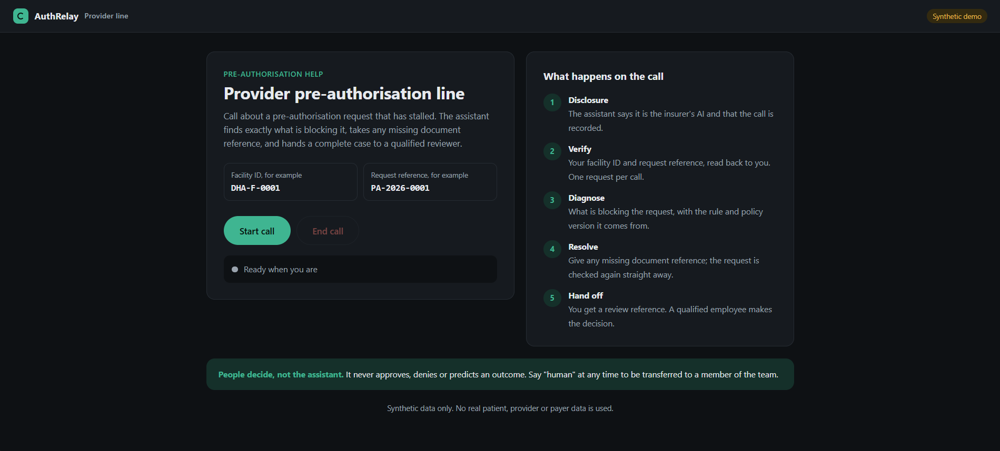
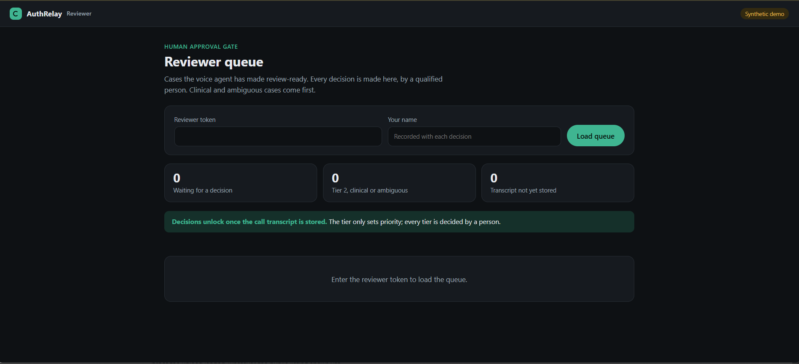

# AuthRelay control plane

Provider pre-authorisation intake and triage. Ignyte × ElevenLabs Future of Voice AI Challenge,
Track 1: Banking & Insurance.

A clinic's approval executive calls about a pre-authorisation request that has already been
submitted through eClaimLink and has stalled. The agent states it is the insurer's AI, verifies the
provider against one request, explains exactly what is blocking it with the rule and policy version,
collects the missing evidence reference on the call, rechecks, and hands a review-ready case to a
qualified employee. It never approves, denies, or predicts a decision.

[ARCHITECTURE.md](ARCHITECTURE.md) covers the system: the call flow, the three zones, what is real
and what is synthetic, and where each guardrail lives. This file covers running it.

## Synthetic data only

Every case, provider, policy and document reference in this repository is synthetic. No real
patient, provider or payer data is present. eClaimLink / DHPO and the insurer authorisation
platform are represented by adapters against local fixtures; they are never contacted. Responses
carry an `X-Data-Mode: synthetic` header.

## Screens

**Provider call page** (`/`): where the clinic's approval executive starts the call. It shows what
to have ready and the five steps the call follows.



**Reviewer queue** (`/review`): where a qualified person decides each case. Cases come ordered by
tier with their open and resolved blockers, and the decision buttons stay locked until the call
transcript is stored.



## Layout

```
main.py         builds the app and mounts the routers
api/            routes, composition root, rate limiting, page templates
services/       the six agent tools, the reviewer's decision, transcripts
policies/       blockers, tiers, policy version by service date, similar cases
database/       SQLite: schema, repositories, append-only audit
interfaces/     protocols the services depend on
dto/  mapper/   shared data shapes, and conversion to response shape
security/       bearer tokens, page token, webhook signature
integrations/   ElevenLabs client, synthetic fixture catalogue
errors/  core/  utils/
agent/          ElevenLabs configuration, versioned with the code
data/           synthetic cases and policies
scripts/        set_tool_host.py points agent/tools.json at a deployment
tests/          unit/, integration/, architecture/
```

[docs/project-structure.md](docs/project-structure.md) has the full tree, what each layer may
import, and where new code goes. Services, policies and the database layer import no web
framework, so every guardrail is testable without a server or a voice call.

## Two credentials

`AGENT_TOOL_TOKEN` reaches `/tools/*`. `REVIEWER_TOKEN` reaches `/review/*` and `/audit/*`. They are
never interchangeable, and no agent-reachable path records a decision.

The reviewer name recorded against a decision is self-declared behind a shared token: it is stored
as a bounded claim, and per-reviewer identity is the SSO step on the production path.

## One open review item per request

A request has at most one undecided review item, enforced by a partial unique index rather than by a
check in the service. A repeated `send_to_review` returns the item already waiting, raising its tier
if the rules now require a higher one, so a retried tool call cannot open a rival item that another
reviewer could decide the other way.

## Minting a session

`/` is public; `/session/signed-url` is not. The call page is served with a short-lived HMAC page
token that the endpoint requires, and both it and the webhook receiver are rate limited per client.
Sessions cost ElevenLabs credit, so the endpoint is not a bare public GET.

## The reviewer page renders as data

The queue is built with DOM methods, never by interpolating strings into `innerHTML`. Summaries are
written by the agent from what a caller said, so treating them as markup would let a caller run
script on the page where the reviewer token is typed.

## Pointing the tools at a deployment

The six webhook definitions in `agent/tools.json` ship with a placeholder host:

```bash
python scripts/set_tool_host.py https://your-host.example.com
python scripts/set_tool_host.py --check     # non-zero while placeholders remain
```

## Lifecycle

The store is opened by the FastAPI `lifespan` and closed on shutdown; routes receive it through
`Depends`, so nothing reaches for a module global and importing the app opens no database. File
databases run in WAL with a 5-second `busy_timeout`, so a contended write waits rather than failing
instantly.

## Run

```bash
python -m venv .venv && .venv/Scripts/activate      # macOS/Linux: source .venv/bin/activate
pip install -r requirements-dev.txt
cp .env.example .env                                 # set the two tokens
uvicorn main:app --env-file .env --reload
```

The app reads plain environment variables; `--env-file` is what loads `.env` locally. In Docker or
on a host, set the same variables in the platform instead.

`/health` reports status and data mode. `/docs` lists the six agent tools and the reviewer
endpoints. `/` is the call page, `/review` the reviewer queue.

## Check

```bash
ruff check .                                   # lint
mypy                                           # types
python -m unittest discover -s tests -t . -v   # 86 tests
```

All three run in CI on every push.

## Status

The control plane runs and its guardrails are tested: **86 tests**, lint and types clean.

| Suite | Tests | Covers |
|---|---|---|
| `tests/unit/` | 10 | policies, normalisation, signatures, bearer check, rate limiter |
| `tests/integration/` | 69 | every use case on a real SQLite store; HTTP, pages, webhook, page token |
| `tests/architecture/` | 7 | the layer rules in docs/project-structure.md |
| Voice agent | none yet | configured on the ElevenLabs platform during the build sprint |

What the tests hold in place: the agent can raise a tier but never lower one; no agent-reachable
path records a decision; one request has at most one open review item, so it cannot be approved and
denied; a call is bound to exactly one request and other requests are refused and audited; the two
tokens are not interchangeable; the audit table rejects UPDATE and DELETE; every tool is audited
under the name the agent called, including `recheck_case`; a callback needs consent written to the
session and read back; webhook signatures are verified and redelivery is idempotent; a review item
can be claimed by only one reviewer; a case that leaves the store mid-call refuses on every tool
rather than raising; `/session/signed-url` refuses a missing, forged or expired page token and rate
limits the rest; the reviewer page contains no `innerHTML` or inline handler.

`agent/tools.json` holds the six webhook tool definitions. The system prompt, workflow and Agent
Testing scenarios are written against the platform from 30 September.

## Milestones

| # | Milestone | State |
|---|---|---|
| 1 | Control plane core: rules engine, storage and audit log, the six agent tools, reviewer decision | Done |
| 2 | API and integrations: HTTP routes, call and reviewer pages, access control, webhook signature, ElevenLabs tool definitions, CI | Done |
| 3 | Layer-boundary tests, architecture and project documentation | Done |
| 4 | Deployment: control plane on a public HTTPS URL | Left |
| 5 | Voice agent on ElevenLabs: five-step call flow, system prompt in English and Arabic, voices, post-call webhook, test scenarios | Left |
| 6 | Reviewer side: Arabic responses, post-call grounding check, reviewer page, policy knowledge base | Left |
| 7 | Final build: end-to-end call, reviewer decision, demo video | Left |

## How we work

- Every task gets its own branch and reaches `main` through a reviewed pull request.
- CI runs lint, type checks and the tests on every pull request.
